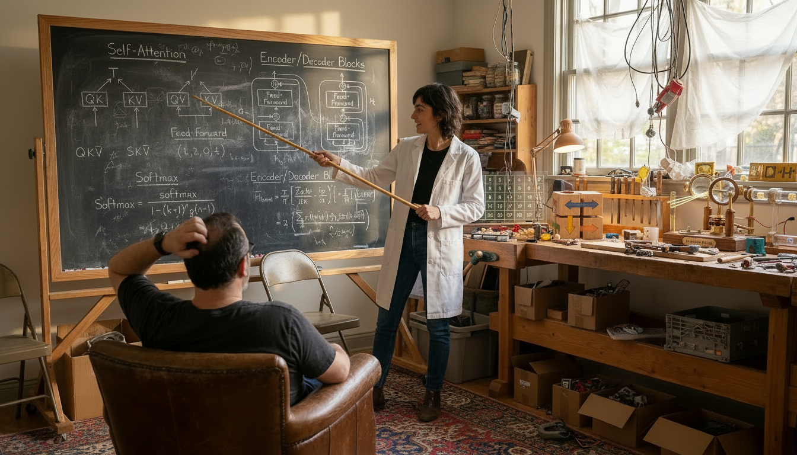
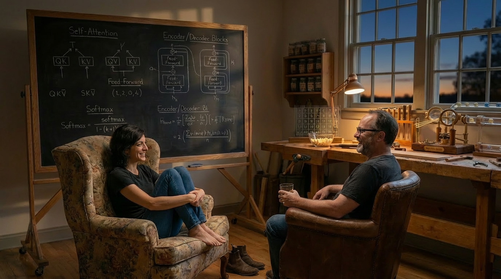
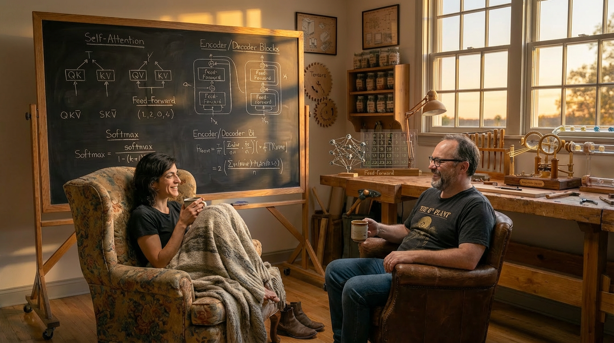

# 2025-12-04 07:18:03

I wrote nothing in yesterday's log. I need to be more careful about that. Yesterday we explored. Tourist mode. We created a new way of working together: Professor Alpha. Alph taught me about attention and backpropagation — some. I still don't know much. But I know more than I did 24 hours ago.

We also worked on Lil Transformy. Build a language model up in layers, in PyTorch.

Also decided to create some moods with Nano Banana Pro to help Alph understand what I need.

And just now:

We'll see how Alph feels about these.